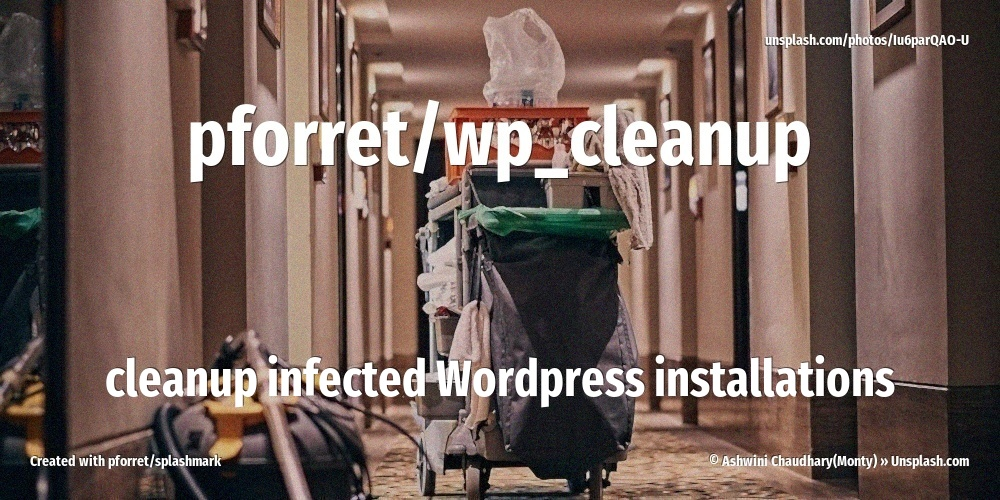

[](https://basher.gitparade.com/package/)

# WP CLEANUP

    Script to clean up infected WordPress installations



## When to use this
When your WordPress installation has been hacked, and one or more WordPress source code files have been changed.
The effect could be that
* your site is still accessible, but when you try to access `/wp-admin` you get an 403 (access denied) error
* your site is off-line, gives an error 500 (server error), or shows an empty page, or a WordPress error
* your site is still accessible but inserts malicious code that generates popup advertising or redirects to other websites

You should go and check the WordPress files with a SSH console or through an (s)FTP connection. Files that were installed by WordPress might have been changed by malicious code (virus/trojan/infection, whatever you want to call it).

A typical example is the `./index.php` file. Normally it should only contain
```php
<?php
/**
   comments don't really matter, there are only 2 lines of real code to be executed 
 */
define( 'WP_USE_THEMES', true );
require __DIR__ . '/wp-blog-header.php';
```

Some viruses insert extra hard-to-read PHP code in to `index.php`:
```php
<?php
 $PxzcQOgNk = function($jWC9KOqRQtX9 ,$MDafuOVYz) {
 $lKnbe="_Qf5zyRU";
 }
return $lKnbe;
(...)
evAL($XG51n);; ?><?php  define('WP_USE_THEMES', true );require(__DIR__.  '/wp-blog-header.php' ); ?>
```

They might also create new files 
(like `admin.php`, which sounds official, but is not part of a normal WP installation), 
or new folders 
(like `psp/`, which again is not part of a normal WP installation).

What you want to do in this case, is restore all WordPress source code files to their original state.
This is what this script does.

## Installation 
* log in to your hacked server (via ssh)
* cd to a folder where you have 'write' permissions

```bash
git clone https://github.com/pforret/wp_cleanup
cd wp_cleanup
./wp_cleanup -W [WP folder] fix
✅  WordPress installation moved to [_infected.20230412_1643]
✴️: # this folder should not be in a WP install -- remove it!
✴️: # rm -fr '.../unusualdir'
✅  Wordpress 6.2 downloaded!
✅  Wordpress system restored!
✅  Copied from themes: testtheme  
✅  Copied from plugins: testplugin  
✅  Wordpress settings copied!
✅  Wordpress .htaccess set!
✅  --- Wordpress cleanup was done
Do you want to compress the infected files? [y/N] Y 
✅  old WordPress moved to _infected.20230412_1643.zip
```

This will
* move your current (infected) WordPress files to a backup folder
* replace your `wp-admin` and `wp-includes` folders with those of a fresh WordPress install
* replace your wp-*.php files with those of a fresh WordPress install
* recover your original `wp-config.php` file
* recover your original `wp-content`: themes,plugins,uploads
* reset your `.htaccess` file

## Usage

```
Program : wp_cleanup  by peter@forret.com
Version : v0.1.5 (2023-04-12 16:49)
Purpose : clean up infected WordPress installations
Usage   : wp_cleanup [-h] [-q] [-v] [-f] [-l <log_dir>] [-t <tmp_dir>] [-W <WP>] [-M <MULTI>] <action>
Flags, options and parameters:
    -h|--help        : [flag] show usage [default: off]
    -q|--quiet       : [flag] no output [default: off]
    -v|--verbose     : [flag] also show debug messages [default: off]
    -f|--force       : [flag] do not ask for confirmation (always yes) [default: off]
    -l|--log_dir <?> : [option] folder for log files   [default: /home/pforret/.wp_cleanup/log]
    -t|--tmp_dir <?> : [option] folder for temp files  [default: /home/pforret/.wp_cleanup/tmp]
    -W|--WP <?>      : [option] WordPress installation folder  [default: .]
    -M|--MULTI <?>   : [option] Multi-site setup: subdomain/subfolder
    <action>         : [choice] action to perform  [options: detect,fix,check,env,update]

### TIPS & EXAMPLES
* use wp_cleanup detect to check if there is an infected WP installation in that folder
  wp_cleanup -W /home/sites/wp_1 detect
* use wp_cleanup fix to run the cleanup (reinstall WP)
  wp_cleanup -W /home/sites/wp_1 fix
* use wp_cleanup check to check if this script is ready to execute and what values the options/flags are
  wp_cleanup check
* use wp_cleanup env to generate an example .env file
  wp_cleanup env > .env
* use wp_cleanup update to update to the latest version
  wp_cleanup update
* >>> bash script created with pforret/bashew
* >>> for bash development, also check IO:print pforret/setver and pforret/IO:progressbar
```

## Valuable articles
* [RESOLVED: cutwin Javascript injection (WordPress)](https://wordpress.org/support/topic/resolved-cutwin-javascript-injection/)
* [FAQ My site was hacked (WordPress)](https://wordpress.org/support/article/faq-my-site-was-hacked/)
* [Removing Malicious Redirects From Your Site (WordFence)](https://www.wordfence.com/learn/removing-malicious-redirects-site/)
* [How To Completely Clean Your Hacked WordPress Installation](https://smackdown.blogsblogsblogs.com/2008/06/24/how-to-completely-clean-your-hacked-wordpress-installation/)

## Test your site

* https://sitecheck.sucuri.net/ (site keeps a cached version of your site, used a random parameter ?test=7763 after the URL to get a new scan)
* http://www.unmaskparasites.com/
* https://www.virustotal.com/gui/home/url

## Check if your site has been flagged as unsafe

* https://transparencyreport.google.com/safe-browsing/search
* https://global.sitesafety.trendmicro.com/
* https://www.trustedsource.org/